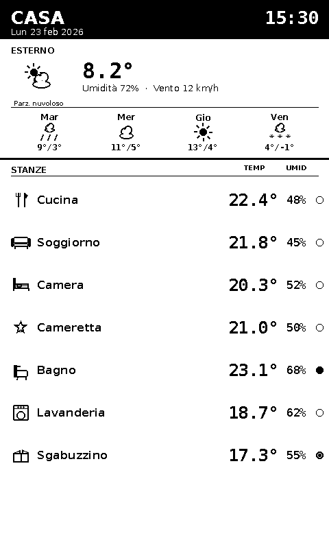

# e-Paper HA Dashboard

100% vibe-coded - 100% manually tested

Portrait dashboard for Waveshare 7.5" V2 e-Paper (800x480) driven by Home Assistant.
It shows outdoor weather, intraday + multiday forecast, indoor room temperature/humidity, and a daily quote.

## Preview



## Quick Start

1. Install dependencies.
```bash
sudo apt install python3-pil python3-numpy python3-rpi.gpio python3-spidev
```

2. Clone Waveshare driver library.
```bash
git clone https://github.com/waveshare/e-Paper ~/src/e-Paper
```

3. Prepare local config files.
```bash
cp secrets.json.example secrets.json
cp config.json.example config.json
```

4. Edit credentials/entities.
```bash
nano secrets.json
nano config.json
```

5. Test with PNG preview.
```bash
python3 ha_epaper_dashboard.py --simulate --output preview.png
```

6. Run on e-Paper.
```bash
python3 ha_epaper_dashboard.py --mode clock-daemon \
  --epd-lib-path ~/src/e-Paper/RaspberryPi_JetsonNano/python/lib
```

## Documentation

- Configuration reference: `docs/CONFIGURATION.md`
- CLI modes and runtime behavior: `docs/USAGE.md`
- systemd service setup: `docs/SYSTEMD.md`
- Localization and translations: `docs/I18N.md`
- Icon assets naming/path rules: `assets/icons/README.md`

Available locales: `en`, `it`, `es`, `fr`, `de`, `pt`

## Notes

- `secrets.json` contains your HA token and must stay private.
- `show_clock: false` disables clock drawing; header shows a larger date instead.
- Daily quote defaults to ZenQuotes (`https://zenquotes.io/api/today`) with local cache.
